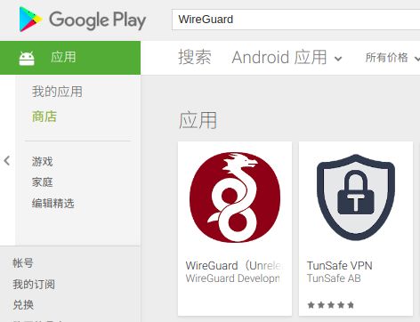
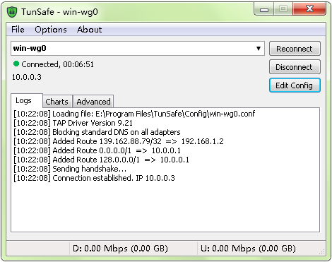
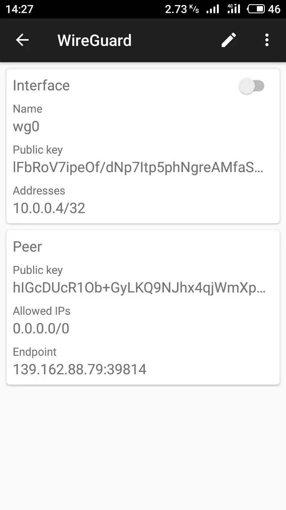
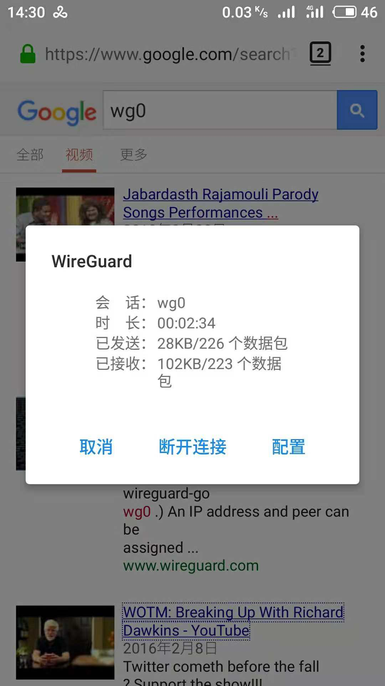

# 5. 多平台访问 WireGuard

WireGuard 网络中任何一个节点都可以成为科学上网的跳转节点，但现在一般把 Linux （支持多种 Linux 发行版）节点配置为跳转服务器。客户端支持不同平台（ Linux 、Windows、安卓、苹果 ），可以在多种设备（台式电脑、平板、手机、智能路由器）上运行。

前面介绍了如何从 Ubuntu 客户端访问 WireGuard 服务器，本文介绍从其它三种常见系统访问  WireGuard 服务器的方法。

## 1. 如何获得 WireGuard 客户端

下面介绍如何获得  WireGuard 客户端，以及它们的基本外观。

### 1.1 Windows

WireGuard 官方的 Windows 版本还没有发布，但 μTorrent 的开发者发布了 Windows 下的客户端 TunSafe 。

 - TunSafe 网址：https://tunsafe.com/
 - 下载地址：https://tunsafe.com/download

<p align="center"></p>

### 1.2 安卓

安卓平台目前有两个客户端软件，一个是 WireGuard 官方发布，一个是第三方的 TunSafe 发布。

<p align="center"></p>

- WireGuard

  - 官方安卓商店：https://play.google.com/store/apps/details?id=com.wireguard.android

  - F-Droid 安装包下载：https://f-droid.org/en/packages/com.wireguard.android/
  - APKPure：https://apkpure.com/cn/wireguard-unreleased/com.wireguard.android

- TunSafe

  - 安卓商店：https://play.google.com/store/apps/details?id=com.tunsafe.app

  - APKPure：https://apkpure.com/cn/tunsafe-vpn/com.tunsafe.app

### 1.3 iOS  

WireGuard 支持 iPhone 与  iPad 的 APP 名为 TestFlight ，现在需要获得邀请才能测试  。

- TestFlight 下载地址：https://itunes.apple.com/cn/app/testflight/id899247664
- 测试说明：https://testflight.apple.com/join/63I19SDT

<p align="center"></p>


## 2. 服务器配置

仍然延续前面的例子，下面介绍服务器端参数的配置，编辑服务器的配置文件，文件存储位置：/etc/wireguard/wg0.conf ，内容如下。

```
[Interface]
Address = 10.0.0.1
ListenPort = 39814
PrivateKey = UA0je5EciV9i2+dSbf5mWAvRkUDVLxE/4ijMb1VnWWw=
PostUp   = iptables -A FORWARD -i %i -j ACCEPT; iptables -A FORWARD -o %i -j ACCEPT; iptables -t nat -A POSTROUTING -o eth0 -j MASQUERADE
PostDown = iptables -D FORWARD -i %i -j ACCEPT; iptables -D FORWARD -o %i -j ACCEPT; iptables -t nat -D POSTROUTING -o eth0 -j MASQUERADE
DNS = 8.8.8.8

[peer]
PublicKey = odnA2mMWrxRuKydr61bOL3xyGcKiD0KY7O33X8Rm4Hg=
AllowedIPs = 10.0.0.2

[peer]
PublicKey = VNXaih1QIJmYPbZUvvGVV6Vx3Qwbba4HliJxsMWB7gY=
AllowedIPs = 10.0.0.3

[peer]
PublicKey = lFbRoV7ipeOf/dNp7Itp5phNgreAMfaSMf7ZLowlO2I=
AllowedIPs = 10.0.0.4/32

```

以上配置中， Peer 分别连接不同的客户端：

- IP 10.0.0.2  连接之前的 Ubuntu 客户端
- IP 10.0.0.3  连接 Windows TunSafe 客户端
- IP 10.0.0.4/32 连接安卓客户端

## 3. Windows 客户端配置

目前 Windows 的 WireGuard 客户端只有 TunSafe ，完成下载与安装后就可以编辑配置文件，编辑完成后存储到：E:\Program Files\TunSafe\Config\win-wg0.conf ，配置文件内容如下：

```
[Interface]
Address = 10.0.0.3/24
ListenPort = 39815
PrivateKey = uBsvTLKujZWVXQH3iTHXigHlhtStW9VxlV3rH8QnBHE=
DNS = 8.8.8.8

[Peer]
AllowedIPs = 0.0.0.0/0
Endpoint = 139.162.88.79:39814
PublicKey = hIGcDUcR1Ob+GyLKQ9NJhx4qjWmXpOcKURXWkMDYKjc=
PersistentKeepalive = 25
```

然后在 TunSafe 中导入配置文件 win-wg0.conf  ，选取 win-wg0 ，如果没有其它问题，很快就会与远程 WireGuard 服务器建立起连接，连接后 TunSafe 显示如下：

<p align="center"></p>


## 4. 安卓客户端使用

目前在安卓系统有两款 APP 支持 WireGuard ，一款是第三方的 TunSafe ，一款是  WireGuard 官方推出的 。它们的配置方式基本相同，都是填写参数，打开开关就可以使用，截图见下。

### 4.1 安卓 - TunSafe

<p align="center"></p>


### 4.2 安卓 - WireGuard

<p align="center"></p>

PS：WireGuard 客户端的配置文件可以导出为一个 .zip 文件，存储在 /storage/emulated/0/Download/wireguard-export.zip ，这个 .zip 文件是对 WireGuard 配置的打包，解压缩后是 .conf 配置文件，可以在 TunSafe 安卓客户端读取使用。
