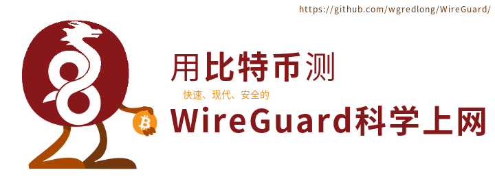

# 6. 付费测试 WireGuard

我们尝试提供一台服务器，供少量用户测试 WireGuard 。

需收取少量比特币，费用、支付及沟通方式见下。

## 1. 费用

| 试用时长 |  费用  |
| :------: | :----: |
|   1月    | 0.0002 |
|   6月    | 0.001  |
|   12月   | 0.002  |
|   24月   | 0.004  |

## 2. 支付地址

支付地址： `17o5tS1mLTe6VwQVQir5uTbLcTQeAxEPHa` 

支付二维码：

  

## 3. 沟通方式

完成支付后，请把支付地址用邮件发过来，然后我们就可以开始下一步的作业。

- 联系我们的邮件：sxrbywp@gmail.com
- 可以在这里沟通不涉及私密信息的问题：https://github.com/wgredlong/WireGuard/issues

